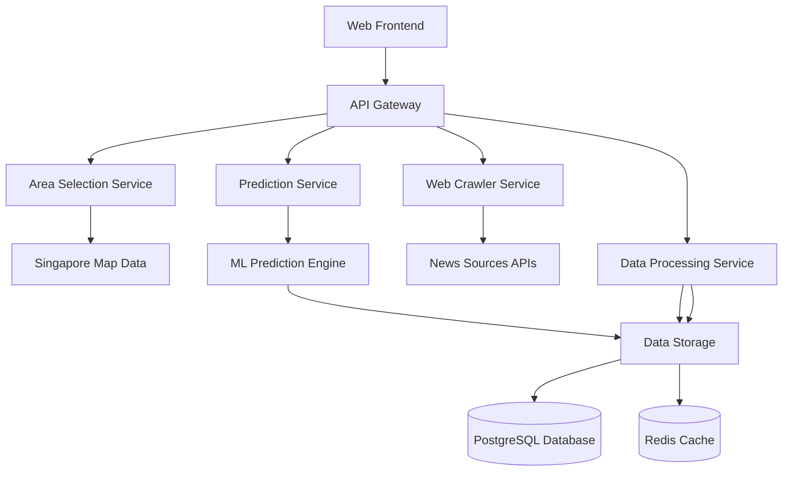

# Design Document - Singapore Housing Predictor

## Overview

The Singapore Housing Predictor is a full-stack web application that combines real-time data collection, machine learning prediction, and interactive visualization to provide housing price forecasts. The system architecture follows a microservices pattern with distinct components for web crawling, data processing, prediction modeling, and user interface.

## Architecture

### High-Level Architecture



### Technology Stack

**Frontend:**
- React.js with TypeScript for type safety
- Leaflet.js for interactive Singapore map
- Chart.js for data visualization
- Tailwind CSS for responsive design

**Backend:**
- Node.js with Express.js framework
- TypeScript for consistent typing
- Bull Queue for background job processing
- JWT for authentication

**Data & ML:**
- PostgreSQL for structured data storage
- Redis for caching and session management
- Python scikit-learn for prediction models
- Beautiful Soup + Scrapy for web crawling

**Infrastructure:**
- Docker containers for deployment
- nginx for reverse proxy
- PM2 for process management

## Components and Interfaces

### 1. Web Frontend Component

**Responsibilities:**
- Interactive Singapore map with area selection
- Prediction form with timeframe input
- Results visualization with charts and metrics
- Historical accuracy dashboard

**Key Interfaces:**
- `MapSelectionInterface`: Handles area selection events
- `PredictionFormInterface`: Manages user input validation
- `ResultsDisplayInterface`: Renders prediction outcomes

### 2. API Gateway

**Responsibilities:**
- Route requests to appropriate microservices
- Handle authentication and rate limiting
- Aggregate responses from multiple services
- Provide unified error handling

**Endpoints:**
```
POST /api/predictions/request
GET /api/areas/search
GET /api/predictions/history
GET /api/accuracy/metrics
```

### 3. Area Selection Service

**Responsibilities:**
- Validate Singapore area boundaries
- Provide area metadata (district, postal codes)
- Handle different granularity levels
- Cache frequently accessed area data

**Key Functions:**
- `validateAreaBoundaries(coordinates)`
- `getAreaMetadata(areaId)`
- `searchAreasByName(query)`

### 4. Web Crawler Service

**Responsibilities:**
- Crawl news sources for development information
- Extract relevant content about schools, infrastructure, shopping, business
- Rate limit requests to avoid blocking
- Store raw article data for processing

**Target Sources:**
- The Straits Times
- Channel NewsAsia
- PropertyGuru News
- EdgeProp Singapore
- Government press releases

**Crawling Strategy:**
- Keyword-based search: "[area name] + development/school/infrastructure/shopping/office"
- Time-bounded: Last 12 months of articles
- Content extraction: Title, date, content, source URL
- Deduplication based on content similarity

### 5. Data Processing Service

**Responsibilities:**
- Clean and normalize crawled article data
- Extract structured information about developments
- Categorize developments by type (school/infrastructure/shopping/business)
- Calculate development impact scores

**Processing Pipeline:**
1. **Text Cleaning**: Remove HTML, normalize encoding
2. **Entity Extraction**: Identify development projects, locations, dates
3. **Categorization**: Classify developments by type using NLP
4. **Impact Scoring**: Assign weights based on development significance
5. **Data Validation**: Verify location relevance and date accuracy

### 6. Prediction Service & ML Engine

**Responsibilities:**
- Train and maintain prediction models
- Generate price forecasts based on historical and development data
- Calculate confidence intervals
- Provide prediction explanations

**Model Architecture:**
- **Base Model**: Linear regression on historical price trends
- **Feature Engineering**: Development impact scores, area characteristics
- **Ensemble Method**: Combine multiple models for robust predictions
- **Confidence Calculation**: Bootstrap sampling for uncertainty estimation

**Key Features:**
- Historical price trends (5-year moving averages)
- Development impact scores by category
- Area characteristics (proximity to MRT, CBD distance)
- Market sentiment indicators from news analysis

## Data Models

### Area Model
```typescript
interface Area {
  id: string;
  name: string;
  district: string;
  postalCodes: string[];
  coordinates: {
    latitude: number;
    longitude: number;
    boundaries: GeoJSON.Polygon;
  };
  characteristics: {
    mrtProximity: number;
    cbdDistance: number;
    amenityScore: number;
  };
}
```

### Development Model
```typescript
interface Development {
  id: string;
  areaId: string;
  type: 'school' | 'infrastructure' | 'shopping' | 'business';
  title: string;
  description: string;
  impactScore: number;
  dateAnnounced: Date;
  expectedCompletion?: Date;
  source: {
    url: string;
    publisher: string;
    publishDate: Date;
  };
}
```

### Prediction Model
```typescript
interface PredictionRequest {
  id: string;
  areaId: string;
  timeframeYears: number;
  requestDate: Date;
  userId?: string;
}

interface PredictionResult {
  id: string;
  requestId: string;
  predictedPrice: number;
  confidenceInterval: {
    lower: number;
    upper: number;
  };
  influencingFactors: {
    developmentId: string;
    impactWeight: number;
    description: string;
  }[];
  modelAccuracy?: number;
  generatedAt: Date;
}
```

### Historical Price Model
```typescript
interface HistoricalPrice {
  id: string;
  areaId: string;
  price: number;
  pricePerSqft: number;
  recordDate: Date;
  propertyType: 'HDB' | 'Condo' | 'Landed';
  source: string;
}
```

## Error Handling

### Web Crawler Error Handling
- **Rate Limiting**: Implement exponential backoff for blocked requests
- **Source Unavailability**: Fallback to alternative news sources
- **Content Parsing Failures**: Log errors and continue with available data
- **Network Timeouts**: Retry mechanism with maximum 3 attempts

### Prediction Error Handling
- **Insufficient Data**: Return prediction with lower confidence and clear warning
- **Model Failures**: Fallback to simpler historical trend analysis
- **Invalid Area Selection**: Provide clear error messages with suggested alternatives
- **Timeout Handling**: Return partial results if processing exceeds time limits

### Data Validation
- **Area Boundary Validation**: Ensure coordinates fall within Singapore
- **Date Range Validation**: Verify prediction timeframes are within supported range
- **Price Data Validation**: Check for outliers and data quality issues
- **Development Data Validation**: Verify extracted information relevance and accuracy

## Testing Strategy

### Unit Testing
- **Service Layer**: Test individual service methods with mocked dependencies
- **Data Processing**: Validate text extraction and categorization algorithms
- **Prediction Models**: Test model accuracy with historical validation data
- **API Endpoints**: Verify request/response handling and error cases

### Integration Testing
- **End-to-End Workflows**: Test complete prediction request flow
- **Database Operations**: Verify data persistence and retrieval
- **External API Integration**: Test web crawling with mock news sources
- **Cache Behavior**: Validate Redis caching and invalidation

### Performance Testing
- **Crawler Performance**: Measure crawling speed and resource usage
- **Prediction Latency**: Ensure predictions complete within 10-second requirement
- **Concurrent Users**: Test system behavior under multiple simultaneous requests
- **Database Performance**: Optimize queries for large datasets

### Validation Testing
- **Historical Accuracy**: Backtest predictions against actual price movements
- **Cross-Validation**: Use different time periods for model training and testing
- **Area Coverage**: Ensure system works across different Singapore districts
- **Edge Cases**: Test with areas having limited development data